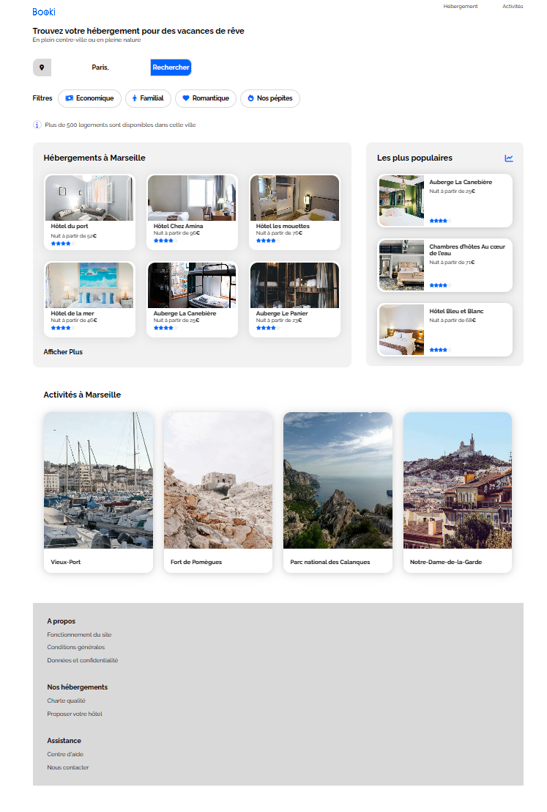
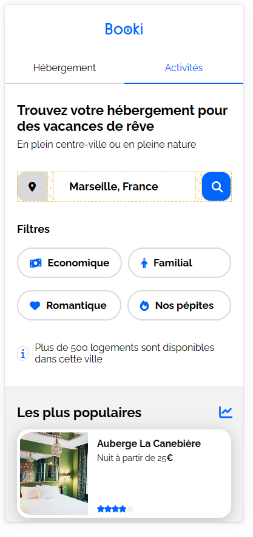

# booki-starter-pack

# Booki

Projet P3 qui a pour but :

# Objectifs

de mettre en place une

**fonction Recherche**

- **Des Liens "Hébergements et Acitivités"**
- **Des cartes "Hébergements Activités"**

# Des Filtres de Recherche

- Des Breakpoints
- Du Desktop first
  
# Une Bibliothèques d'icônes

Les icones proviennet de la Bibliothèque Font Awesome

# Une Police

 **Raleway**

# Des Balises sémantiques

header / nav / h1 / h2 / h3 / main / section / article / footer

**Validité du code aux validateurs W3C => HTML et CSS**

**Compatibilité sur plusieurs Naigateurs**

# Restrictions

Pas de **Framework CSS** (type Bootstrap ou Tailwind CSS) ou faire du **SASS** ou **LESS**
pas de **JavaScript**
